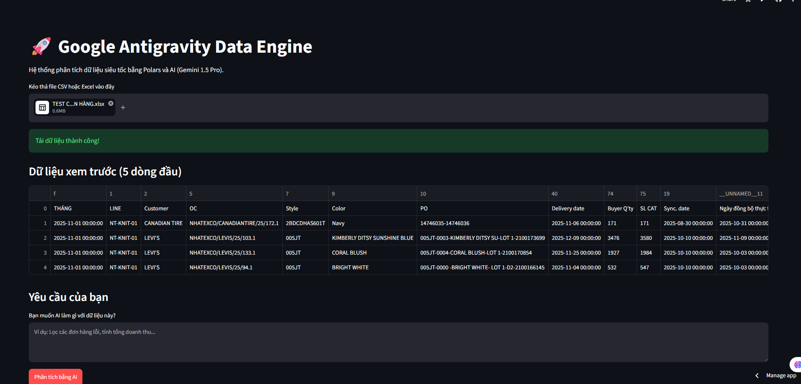

# 📊 Excel Script Using AI



**Excel Script Using AI** is an ultra-high-speed data analysis and processing system, specifically designed to automate data cleaning tasks and generate code (Google Apps Script / Python) using the power of Artificial Intelligence.

## ✨ Key Features
- **Lightning Fast with Polars:** Process millions of rows of tabular data (CSV/Excel) in the blink of an eye, completely outperforming traditional spreadsheet software.
- **Smart AI Assistant:** Deeply integrates AI to automatically analyze data structures, detect anomalies, and provide accurate coding solutions.
- **Intuitive UI:** Built with Streamlit, it features a user-friendly drag-and-drop interface and allows direct interaction with AI using natural language.

## 🚀 Local Installation
1. Install the required dependencies:
   ```bash
   pip install -r requirements.txt
   ```
2. Rename `.env.example` to `.env` and insert your API Key.
3. Start the application:
   ```bash
   python -m streamlit run app.py
   ```

## 🌐 Online Deployment
This system can be easily deployed to **Streamlit Community Cloud**. Simply connect this repository, configure the API Key in the *Secrets* section, and the app will run 24/7.
